# スピードマップ苦手民によるおテックな話
🌅 こんばんは、朝です 🌅

## なにこれ？ <!-- omit in toc -->
**[Beat Saber Advent Calendar 2022](https://adventar.org/calendars/7359) 12月15日（木) の記事です。**

たぶん 12月15日の午前45時（日本標準時）くらいに公開されていると思います。おはようございました。

### スピードマップと関係あるんですか？  <!-- omit in toc -->
たぶんあります。ランク譜面はスピードマップもいっぱいあるから。

ちなみにスピード譜面は嫌いじゃないです。苦手なだけで。いうほど苦手ではないかもしれませんが。

### おテックって何ですか？  <!-- omit in toc -->
テック譜面のことだと思ったあなた、テック譜面に毒されていますね。よいですね、とてもよいと思います。

**おテック譜面はよいぞ！！**

でもごめんなさい、**譜面の話ではありません**。なぜなら今は朝だから。
テックはテックでも Technology のテックです。**プログラムのお話です**。あしからず。

### で、なにこれ？  <!-- omit in toc -->
**[ScoreSaber](https://scoresaber.com) のランキング情報を配信画面に載せたり**、食べた譜面の一覧やその進捗を画像として取得してツイートしたり、そんなことをするツールです。

👇 これです 👇
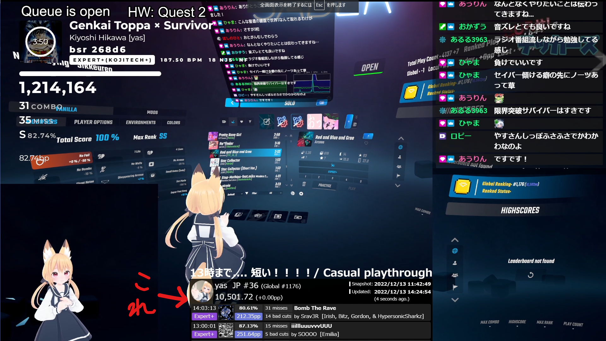  

あまなつちゃんかわいいね。

## 目次 <!-- omit in toc -->
- [基本的な使い方](#基本的な使い方)
  - [1. ダウンロードと解凍～実行](#1-ダウンロードと解凍実行)
  - [2. 管理ページの起動と初期設定](#2-管理ページの起動と初期設定)
  - [3. スナップショットの取得と設定](#3-スナップショットの取得と設定)
  - [4. オーバーレイの表示](#4-オーバーレイの表示)
- [詳細な説明など](#詳細な説明など)
  - [スナップショットについて](#スナップショットについて)
    - [スナップショットの取得方法](#スナップショットの取得方法)
    - [デフォルトスナップショット (Default Snapshot) について](#デフォルトスナップショット-default-snapshot-について)
  - [オーバーレイ画面について](#オーバーレイ画面について)
  - [コントロールつきオーバーレイ画面](#コントロールつきオーバーレイ画面)
    - [オーバーレイ画面のスクリーンショット](#オーバーレイ画面のスクリーンショット)
- [配信での使い方](#配信での使い方)
  - [Default URL を指定した OBS Studio の Browser Sourceによる表示](#default-url-を指定した-obs-studio-の-browser-sourceによる表示)
- [配信後・PP摂取後の使い方](#配信後pp摂取後の使い方)
  - [スコア記録のついった投稿とか](#スコア記録のついった投稿とか)
- [テッカー向けの雑な説明](#テッカー向けの雑な説明)
  - [動作環境](#動作環境)
  - [データの保存場所](#データの保存場所)
  - [ごめんね](#ごめんね)
- [連絡先など](#連絡先など)
- [免責とか](#免責とか)

## 基本的な使い方
### 1. ダウンロードと解凍～実行
1. 下記のうち、需要にあった zip ファイルをダウンロードします。
   1. 最新版のリリースはこちら
      1. https://github.com/yatakabs/BeatSaberRankOverlay/releases/latest
   2. 下記に従って DL するファイルを選択
      1. **なんもわからんけど使えればよし！って人 -> `BeatSaberRankOverlay_*.*.*_win-x64_selfcontained.zip` (おすすめ)**
         - 執筆時の最新版は [こちら (Version 0.0.1)](https://github.com/yatakabs/BeatSaberRankOverlay/releases/download/release-v0.0.1/BeatSaberRankOverlay_0.0.1_win-x64_selfcontained.zip)
      2. .NET Framework 7.0 Runtime がインストールされててDLするファイルが軽い方が良い人とか -> `BeatSaberRankOverlay_*.*.*_win-x64_framework-dependent.zip`
         - 執筆時の最新版は [こちら (Version 0.0.1)](https://github.com/yatakabs/BeatSaberRankOverlay/releases/download/release-v0.0.1/BeatSaberRankOverlay_0.0.1_win-x64_framework-dependent.zip)
2. **ダウンロードした zip ファイルを解凍**すると、下記のようなファイルが現れます。
   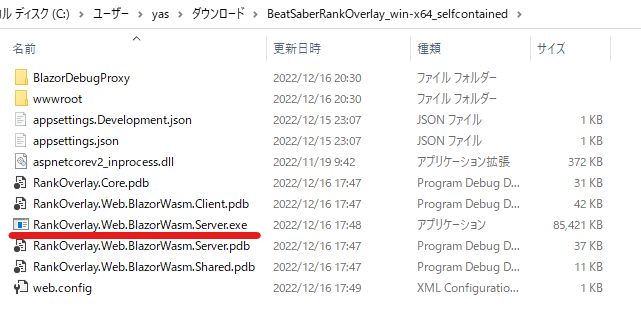  
3. その中にある **`RankOverlay.Web.BlazorWasm.Server.exe` を実行**します。

### 2. 管理ページの起動と初期設定
1. `RankOverlay.Web.BlazorWasm.Server.exe` を実行すると、下記のようなウィンドウが表示され、設定画面の URL が表示されます。
   - たぶん http://localhost:5000 だと思います。
   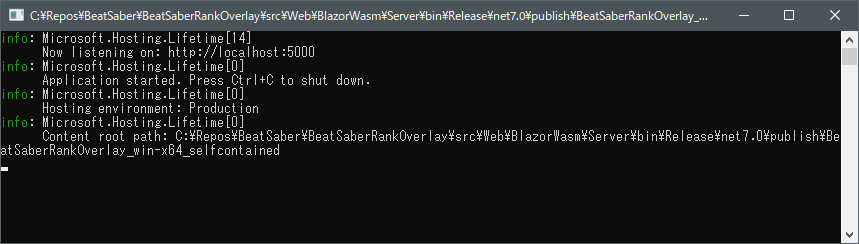  
2. Web Browser でその URL を開きます。
3. `ScoreSaber ID` の欄に [ScoreSaber](https://scoresaber.com) の ID を入力して、`Load` ボタンを押します。
    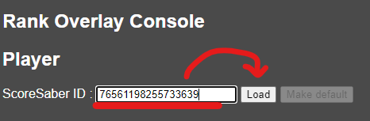  
4. ロードが成功したら、下記のように ScoreSaber から取得下プレイヤー情報が表示されます。
   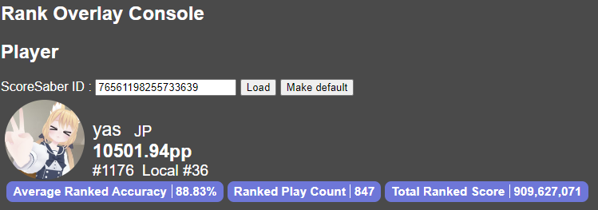  
5. `Make default` ボタンを押して、次回以降の起動時にこのユーザ情報が自動的に読み込まれるようにします。

### 3. スナップショットの取得と設定
1. 現在のスナップショットを取得し、それをデフォルトとして設定するため `Take a new snapshot (set as a default)` ボタンをクリックします。
     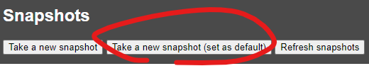  
   - `Take a new snapshot` を先に実行して、その後特定のスナップショットを `Make default` ボタンでデフォルトに設定することもできます。

2. `Default Snapshot` の欄に取得されたスナップショットが表示され、`All Snapshots` の欄に取得したスナップショットが一覧表示されます。
     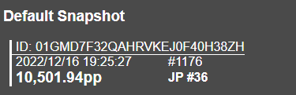  

### 4. オーバーレイの表示
1. `Snapshots -> Overlay -> Default Overlay URLs` の `No Control` のリンクを開くと、取得しデフォルトとして設定したスナップショットと現在の差分情報をオーバーレイ用画面として表示するページがみられます
    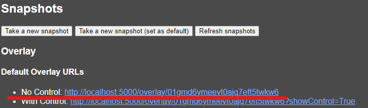  
2. このページを OBS Studio の Browser Source に設定するなどして、配信に利用します。
    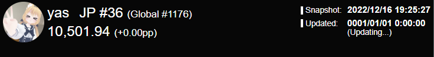  

## 詳細な説明など
### スナップショットについて
この Rank Overlay は、ある時点でのユーザのスコアなどを**スナップショット**として保存し、あるスナップショットと現在における差分を表示するよう作られています。

#### スナップショットの取得方法
初期設定までが完了すれば、`Snapshots` というメニューが表示されているはずです。
スナップショットは `Take a new snapshot` ボタンをクリックすることで取得ができ、画面の一番下に、これまでに取得したスナップショットの一覧が新しい順に表示されます。
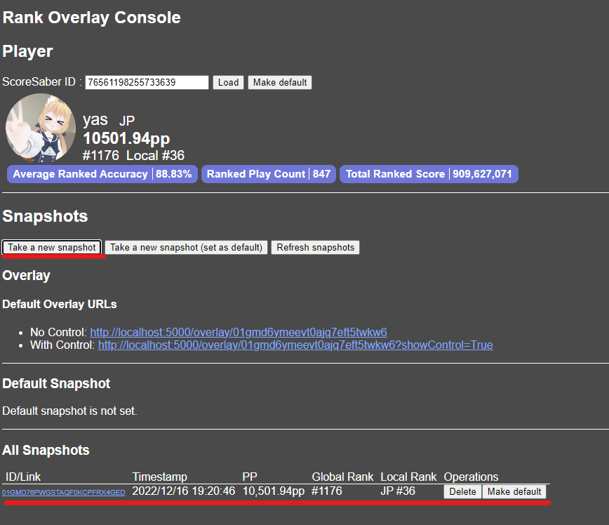  

#### デフォルトスナップショット (Default Snapshot) について
任意のスナップショットをデフォルト (`Default Snapshot`) として指定し、他のいくらかの機能に役立てることができます。

デフォルトスナップショットを設定する方法は、下記の二通りがあります。
1. 画像中最下部の `All Snapshots` の一覧からデフォルトとして設定したいスナップショットの `Make default` ボタンを押す
2. `Snapshots` メニューの `Take a new snapshot (set as default)` を押して、その時点のスナップショットを取得しつつ、それをデフォルトとして設定する

この操作を行うと、`Default Snapshot` 欄に指定したスナップショットが表示され、そのスナップショットのオーバレイを表示するためのURLや、そのスナップショットと現在でのスコア差（`Score Diff`）が表示されます。
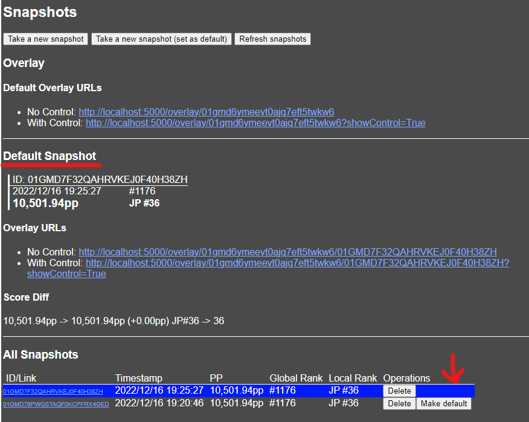  

### オーバーレイ画面について
上記の画像中には `Snapshots -> Overlay -> Default Overlay URLs` と `Default Snapshot -> Overlay URLs` の二箇所に、オーバーレイを表示するための URL が表示されています。
これらは下記のように使い分けることができます。

1. 上部の `Snapshots -> Overlay -> Default Overlay URLs` のページは、オーバーレイ画面のページをリロードした時点でデフォルトに設定されていたスナップショットとの差分を表示します。 
   - **OBS Studio などにブラウザソースで追加する場合、通常はこちらを利用します**。
   - 例：`http://localhost:5000/overlay/01gmd6ymeevt0ajq7eft5twkw6`
2. 下部の `Default Snapshot -> Overlay URLs` のページは、その時点でデフォルトに設定されているスナップショット固有のオーバーレイ画面を表示します。
   - その後 デフォルトスナップショットを変更しても、この URL で表示したオーバーレイは、そのスナップショットと現在の差分を表示します。

### コントロールつきオーバーレイ画面
`With Control` と示されているオーバーレイのURLを開くと、上部にそのスクリーンショットを撮影するためのボタンが付加されたオーバーレイ画面が表示されます。
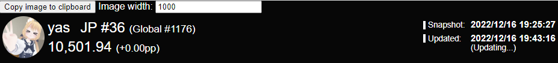 

#### オーバーレイ画面のスクリーンショット
コントロールつきオーバーレイの画面で `Copy image to clipboard` ボタンを押すと、`Image width` の入力欄で指定された横幅で、その**画面のスクリーンショットをクリップボードにコピー**できます。

コピーした画像の例
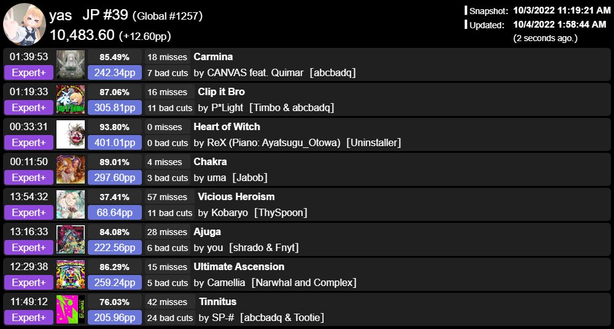 

これを Twitter の投稿時に貼り付け（`Ctrl+V`）て、ツイートに添付することができます。
例: https://twitter.com/yatakabs/status/1576980599436296201
 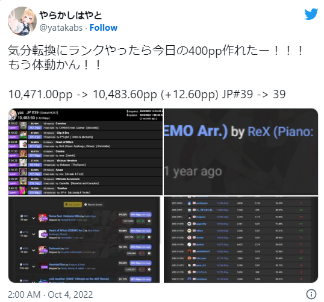  

## 配信での使い方
[基本的な使い方](#基本的な使い方) で示したステップのうち、配信前に下記のステップを踏むとよいでしょう。
1. Beat Saber Rank Overlay (`RankOverlay.Web.BlazorWasm.Server.exe`) を実行
2. 管理画面 (`Rank Overlay Consoel`) を開く
   - 方法は [2. 管理ページの起動と初期設定](#2-管理ページの起動と初期設定) を参照
3. `Take a new snapshot (set as a default)` ボタンを押して、デフォルトのスナップショットを更新
4. OBS Studio のブラウザソースなど、オーバーレイを表示しているブラウザを更新
   - **ブラウザソースには `Default Overlay URLs` の `No Control` を利用してください**。

これで、配信を開始する前の状態との差分が画面に表示されるようになります。

### Default URL を指定した OBS Studio の Browser Sourceによる表示
1. [基本的な使い方](#基本的な使い方) に従って初期設定を行います
2. `Default Overlay URLs` の `No Control` に示された URL をコピーします
      
3. OBS Studio で現在のシーンに Browser Source を追加し、下記の通り設定します
   1. `URL` に、前のステップでコピーした `No Control` の `Default Overlay URL` を入力
   2. `Width` / `Height` はお好みで設定
   3. `Custom CSS` は全て削除
      - 必要に応じてカスタマイズを施しても大丈夫です
   4. `OK` ボタンを押して、 Browser Source の設定を完了
   5. 画面上でお好みの位置に Browser Source を表示するようレイアウトを調整

パラメータとかはいろいろ違いますが、下の画像は設定方法の一例です。
Query Parameter はスクショと同じものに対応していますが、~~パラメータをまとめるのが面倒なので~~ 気になる方はソースコードをご確認くださいませ。
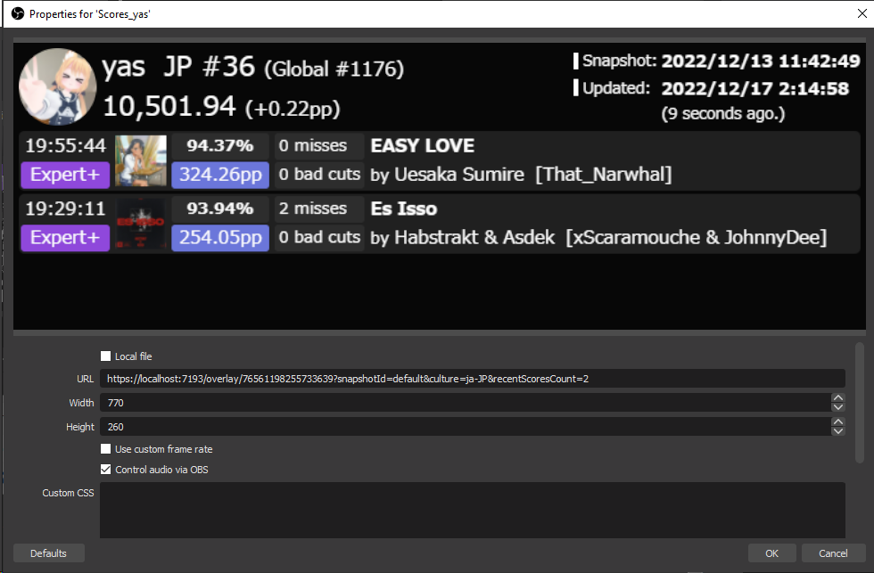  

これで、OBS の画面上（配信画面上）に Beat Saber Rank Overlay を表示できました。配信ボタンを押して地獄のようなランク配信をはじめましょう。

## 配信後・PP摂取後の使い方
### スコア記録のついった投稿とか
1. [オーバーレイ画面のスクリーンショット](#オーバーレイ画面のスクリーンショット) に従って画像としてコピーし記録として残せます。
2. `Rank Overlay Console` （管理画面） の `Default Snapshot -> Score Diff` をコピーしてスクリーンショットと共にツイートするなり焼くなりしましょう。
3. `Take a new snapshot` ボタンをおして、ビーセイ終了時の記録を残しておくと、PPカーブや☆に変更があったときなど、差異がわかって便利です。

## テッカー向けの雑な説明
※ プログラム書いたりする人の意味での「テッカー」です

### 動作環境
- ASP.NET Core 7.0 Runtime が必要です。開発には同 SDK が必要です。 
  * ダウンロードはこちらから -> [.NET 7.0 のダウンロード](https://dotnet.microsoft.com/ja-jp/download/dotnet/7.0)
- Windows でしかテストしていませんが、Linux / Mac でも動くと思います。
- Dockerfile 用意するのわすれてました。（そのうちやります）

### データの保存場所
- 初期状態では実行ファイルがあるディレクトリ内に `.database` というディレクトリが作成され、その中に格納されます。ファイルベースです。
- `Storage__Blob__BaseDirectory` という環境変数で、このディレクトリの場所を指定できます。
  - `ASP.NET Core` がデフォで読めるものを読んでいるので実行時引数や `appsettings.json` への記載でもおｋです。
  - 環境変数の例： `set Storage__Blob__BaseDirectory="D:\bs-rank-overlay\.database"`

### ごめんね
- `Blazor WASM` のプロジェクトはいろいろ実験しながらなのでめっちゃ汚いです。そのうちきれいにします。きっと。

## 連絡先など
1. 要望・質問などはかきの何れかへご連絡を。
   1. [Issue としてこのリポジトリで報告](https://github.com/yatakabs/BeatSaberRankOverlay/issues)
   2. [Twitter](https://twitter.com/yatakabs)

## 免責とか
1. このプログラムの利用によって生じたいかなる不利益も、開発者は一切の責任を負いません。
2. 機能追加やバグ修正の依頼・相談など、全てに応じられる訳ではありません。お返事なども遅れがちになることがあるかもしれませんが、気長にお待ちいただく・ご自身で clone/fork して改造するなど他の手段もご利用ください。
3. この記事は一発書きで推敲していないので変な間違いがあったらごめんなさい。予告無しに修正されたりもすると思います。
